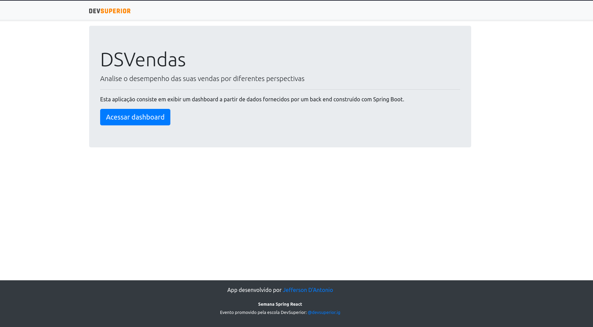
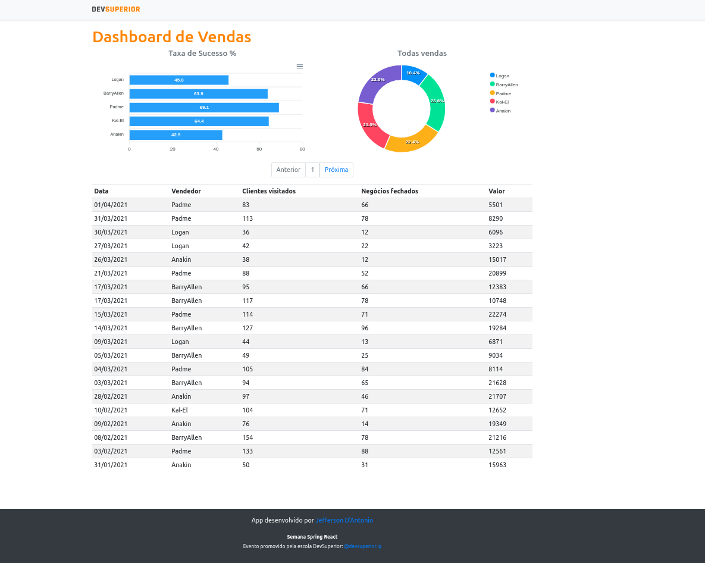

<h1 align="center">
    
DSVendas

    
    
    
    
    
    
</h1>

    Esse projeto foi desenvolvido durante a semana React Spring da escola <a href="https://devsuperior.com.br/"target="_blank">DevSuperior.</a> 
     
    O projeto consiste em uma aplicação web para demostrar um dashboard de vendas.
     
    O <a href="https://jeffersondantonio-dsvendas.netlify.app/" target="_blank">Projeto</a> foi publicado no Netlify  e Heroku 
      
    <a href="https://jeffersondantonio-dsvendas.netlify.app/" target="_blank"> Link para o projeto</a>

## :computer: Layouts

   
    
   

    
## 🛠 Tecnologias

As seguintes ferramentas foram usadas na construção do projeto:

- [HTML](https://www.w3.org/html/)
- [CSS](https://www.w3.org/Style/CSS/)
- [React](https://pt-br.reactjs.org/)
- [TypeScript](https://www.typescriptlang.org/)
- [Java](https://www.java.com/pt-BR/download/help/whatis_java.html)
- [Spring](https://spring.io/)
- [H2](https://www.h2database.com/html/main.html)
- [PostgreSQL](https://www.postgresql.org/)

## Autor

Jefferson D'Antonio Malaquias 

